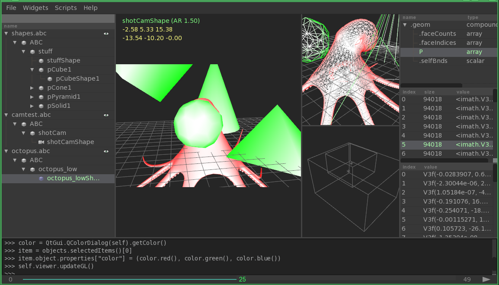

AbcView
=======

.. moduleauthor:: Ryan Galloway <ryang@ilm.com>

AbcView is a graphical PyQt-based Alembic inspection and visualization tool.
It offers a number of widgets to help you inspect and visualize your Alembic
data, as well as assemble hierarchical scenes. 

    * Object, property, sample and value widgets
    * Deferred loading for all Alembic objects
    * Built-in instancing of Alembic archives
    * Hierarchical scene assembly (with standard JSON output)
    * Python console for closer inspection of Alembic objects
    * Playback or step through animation using the Timeline widget
    * Per-camera render modes (box, fill, line, point)
    * Widgets are embeddable in other PyQt applications

Requirements
------------

The following libs are required to use AbcView:

    * Alembic 1.5
    * PyOpenGL
    * PyAlembic (and PyAbcOpenGL)
    * PyQt4
    * Python 2.6+
    * argparse if using Python 2.6

To build the `abcview` wrapper inside your Alembic build dir, make sure the "examples" 
subdirectory is active in the /python/CMakeLists.txt file ::

    ADD_SUBDIRECTORY( examples )

Basic Usage
-----------

Loading one or more Alembic scenes ::

    > abcview <file1.abc> ... <fileN.abc> [OPTIONS]

Save your session at any time using File->Save/Save As. Loading a saved session is the
same as loading an Alembic scene ::

    > abcview <file.io>

You can also inspect and manipulate session data using the AbcView API, for example ::

    >>> from abcview.io import Session
    >>> s = Session()
    >>> s.add_file("file.abc")
    >>> s.save("file.io")

There are a number of properties you can set on session items, such as TRS values, color
and GL rendering mode ::

    >>> from abcview.io import Mode
    >>> item = s.items[0]

GL poylgon draw mode ::

    >>> item.mode = Mode.FILL

GL material color ::

    >>> item.color = (0, 255, 0)

Transation, rotation and scale ::

    >>> item.translate = (10, 0, 100)
    >>> item.rotate = (0, 90, 0, 0)
    >>> item.scale = (1, 1, 1)

AbcView supports both custom (non-animated) cameras and loading ICameras from Alembic
archives. To load an ICamera from the GUI, navigate to the ICamera in the objects 
widget and right-click->view through selected. You can also add it to the session using 
the IO module ::

    >>> s.add_camera(ICamera(get_object("shotcam.abc", 
                                        "ShotCam")
                             loaded=True))
    >>> s.save()

Module Contents
---------------

The AbcView Python API is divided into the IO and GL modules, widgets and utils.

I/O Module
~~~~~~~~~~

.. automodule:: abcview.io
   :members: 

GL Module
~~~~~~~~~

.. automodule:: abcview.gl
   :members: 

Widgets
~~~~~~~

.. automodule:: abcview.widget.tree_widget
   :members: 

.. automodule:: abcview.widget.viewer_widget
   :members: 

Utils
~~~~~

.. automodule:: abcview.utils
   :members: 

