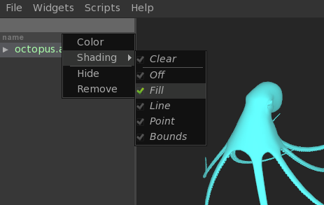
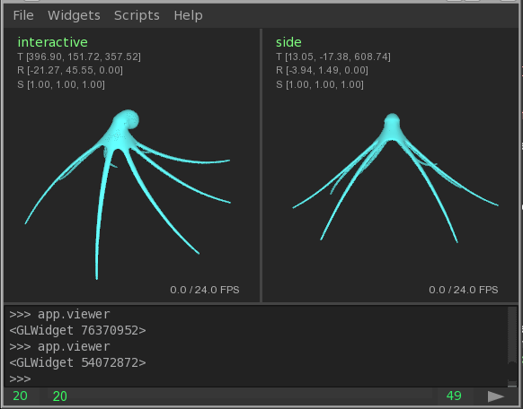

AbcView 1.0.7
=============

.. moduleauthor:: Ryan Galloway <ryang@ilm.com>

AbcView is a graphical PyQt-based Alembic inspection and visualization tool.
It offers a number of widgets to help you inspect and visualize your Alembic
data, as well as assemble hierarchical scenes. 

    * Object, property, sample and value widgets
    * Deferred loading for all Alembic objects
    * Hierarchical scene assembly (standard JSON format)
    * Python console for closer inspection of Alembic objects
    * Playback or step through animation using the Timeline widget
    * Per-camera render modes (box, fill, line, point)
    * Widgets are embeddable in other PyQt applications

.. image:: abcview.png
   :width: 800
   :align: center

Requirements
------------

AbcView has the following requirements:

    * Alembic 1.5+
    * Python 2.6+
    * PyAlembic
    * PyAbcOpenGL
    * PyOpenGL
    * PyQt4
    * argparse

For your convenience, AbcView comes with a csh wrapper that sets up your environment for running
AbcView from your Alembic build directory. To build the wrapper inside your Alembic build dir, make 
sure the "examples" subdirectory is active in the ``/python/CMakeLists.txt`` file ::

    ADD_SUBDIRECTORY( examples )

Basic Usage
-----------

Loading one or more Alembic :py:class:`scenes <.Scene>` 
or AbcView :py:class:`sessions <.Session>` ::

    abcview [file1 .. fileN] [OPTIONS]

    positional arguments:
      filepath              File to open.

    optional arguments:
      -h, --help            show this help message and exit
      -f FRAME, --frame FRAME
                            Frame to load in viewer.
      --first FIRST         Set viewer first frame value.
      --last LAST           Set viewer last frame value.
      --bounds              Force scene bounds display mode.
      --review              Use review display settings.
      --reset               Reset settings.
      -v, --verbose         Verbose output.
      --script SCRIPT       Load and execute Python script.

Using the ``--bounds`` option tells AbcView to force displaying scenes in bounding box mode.
If the ``.childBnds`` property is written at export time, this means that AbcView
can get the bounds information from the archive rather than the GL scene, which usually means
a much faster load time.

Save your session at any time using File->Save/Save As. Loading a saved session is the
same as loading an Alembic scene ::

    $ abcview file.io

Display Modes
-------------

AbcView supports various OpenGL display modes for scene data. Each scene and camera can
have their own display mode.

Scene display modes are available by right-clicking on a scene in the Objects widget:

    * `Clear` - Inherit the display mode from the camera
    * `Off` - Do not display this scene
    * `Fill` - Display in selected scene in smooth shaded mode (default)
    * `Line` - Display the selected scene in line mode
    * `Point` - Display the scene in point mode
    * `Bounds` - Per-object bounding boxes [1]

Camera display modes are available by right-clicking anywhere in the Viewer widget:

.. image:: cameradisplay.png
   :width: 400
   :align: center

AbcView also has a concept of "load state": each :py:class:`scene <.Scene>` has a load state value of either
``true`` or ``false``. This value is changed by clicking on the "eye" icon in the Objects widget
next to the scene. Toggling the load state will tell AbcView to load or unload the scene from the GL Viewer, 
but it is still available in the Objects widget.

A scene's load state is stored in the session .io file as "loaded" under the scene item. ::

        "items": [
            {
                ...
                "loaded": true, 
                ...
            }

**[1] Note:** Object bounds is different from scene bounds (Shift+B). Turning on the scene bounds
option will display a single bounding box for the entire scene, and object bounds is a scene display 
mode that shows bounding boxes for each object within that scene.

Console Widget
--------------

The Console widget is an embedded Python interpreter (the same Python process currently
running AbcView) with preloaded Python modules and convenience handles.

Pre-loaded modules:

    * ``abcview`` - Pre-loaded :ref:`AbcView Python API <python-api-label>`
    * ``alembic`` - Pre-loaded Alembic Python API

Convenience handles to AbcView widgets:

    * ``app`` - Main :py:class:`application <.AbcView>` accessor
    * ``objects`` - Objects widget accessor
    * ``properties`` - Properties widget accessor
    * ``samples`` - Samples widget accessor

Accessing the current :py:class:`.Session` in the console, or in a script that gets called from
an AbcView session, is therefore simply: ::

    >>> app.session

Importing a session or Alembic cache: ::

    >>> app.import_file(filepath)

Getting a handle on the currently selected object, property or sample: ::

    >>> objects.selected()
    <alembic.Abc.IObject object at 0x211ccc8>
    >>> properties.selected()
    <alembic.Abc.IArrayProperty object at 0x21816b0>
    >>> samples.selected()
    <imath.V3fArray object at 0x1ff81a0>

The current :py:class:`state <.GLState>` of the :py:class:`viewer <.GLWidget>` can be accessed like this: ::

    >>> app.viewer.state

The list of loaded :py:class:`scenes <.Scene>` and :py:class:`cameras <.Camera>` can be access from the state object: ::

    >>> app.viewer.state.scenes
    [<GLScene "octopus.abc">]
    >>> app.viewer.state.cameras
    [<GLCamera "interactive">, <GLCamera "side">]

**Note:** AbcView can have multiple :py:class:`viewer <.GLWidget>` 
and :py:class:`camera <.GLCamera>` instances (RMB->Layout->Split). The ``app.viewer`` accessor is always 
set to the `current` viewer, that is, the one most recently interacted with. 
Clicking on another viewer window will change the value of ``app.viewer``. 

The above screen capture shows the value of ``app.viewer`` changing after clicking on each 
viewer widget.

.. _python-api-label:

Python API
----------

You can inspect and manipulate :py:class:`session <.Session>` data using the AbcView Python API, 
for example ::

    >>> from abcview.io import Session
    >>> s = Session()
    >>> s.add_file("file.abc")
    >>> s.save("file.io")

There are a number of properties you can set on session items, such as TRS values, color
and GL rendering mode ::

    >>> from abcview.io import Mode
    >>> item = s.items[0]
    >>> item.mode = Mode.FILL

Change the display color ::

    >>> item.color = (0, 255, 0)

Set transation, rotation and scale values ::

    >>> item.translate = (10, 0, 100)
    >>> item.rotate = (0, 90, 0, 0)
    >>> item.scale = (1, 1, 1)

AbcView supports both custom non-animated :py:class:`Cameras <.Camera>` and loading 
:py:class:`ICameras <.ICamera>` from Alembic archives. To load an ICamera from the GUI, 
navigate to the ICamera in the objects widget and right-click->view through selected. 
You can also add it to the session using the :py:mod:`IO module <abcview.io>` ::

    >>> from abcview.io import ICamera, get_object
    >>> s.add_camera(ICamera(get_object("shotcam.abc", 
                                        "ShotCam")
                             loaded=True))
    >>> s.save()

Writing Scripts
---------------

Writing scripts for AbcView is straight-forward. Anything you can do in the Console
widget can be saved to a script file and called from the AbcView Scripts menu.

Script Configuration
~~~~~~~~~~~~~~~~~~~~

The Scripts menu is populated by looking for .py files along the
paths defined by the ``ABCVIEW_SCRIPT_PATH`` environment variable, or by placing
files in the scripts subdir of the abcview Python package. Script directory
definitions can also be configured in the ``lib/abcview/config.py`` file. 

There are few restrictions on what you can write in an AbcView script.
Scripts are executed by AbcView's console widget, which simply makes a call to
``execfile`` in the current AbcView session.

Defining a Python docstring at the top of your script will populate the menu tooltip
as you mouseover scripts in AbcView. For example ::

    """
    My Awesome AbcView Tool
    """

The name of the script, version and author are similary defined using private
attributes, for example ::

    __name__ = "My Awesome Tool"
    __version__ = "1.0"
    __author__ = "Joe Animator"

Module Contents
---------------

The AbcView Python API is divided into the IO and GL modules, widgets and utils.

App Module
~~~~~~~~~~

.. automodule:: abcview.app
   :members: 

I/O Module
~~~~~~~~~~

.. automodule:: abcview.io
   :members: 

GL Module
~~~~~~~~~

.. automodule:: abcview.gl
   :members: 

Widgets
~~~~~~~

.. automodule:: abcview.widget.tree_widget
   :members: 

.. automodule:: abcview.widget.viewer_widget
   :members: 

Utils
~~~~~

.. automodule:: abcview.utils
   :members: 

